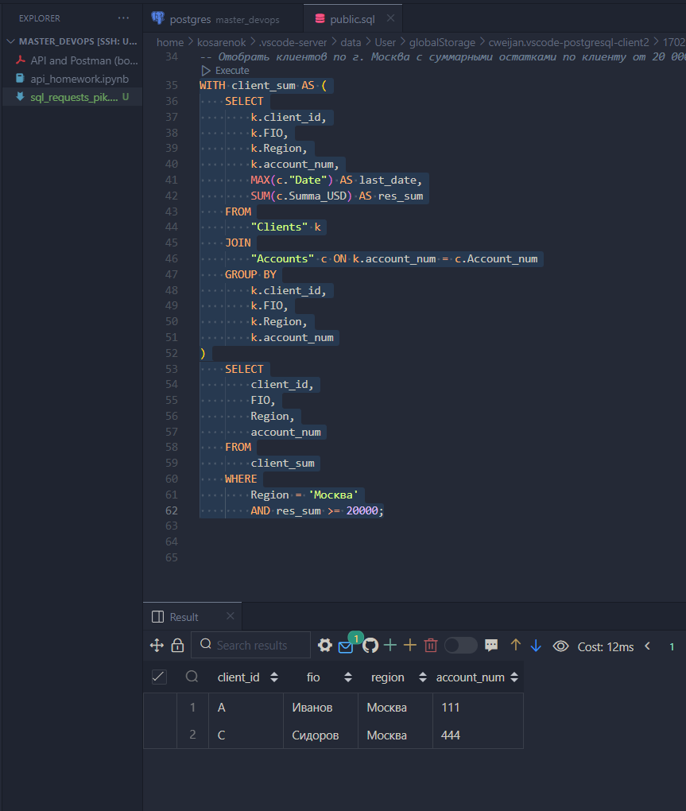
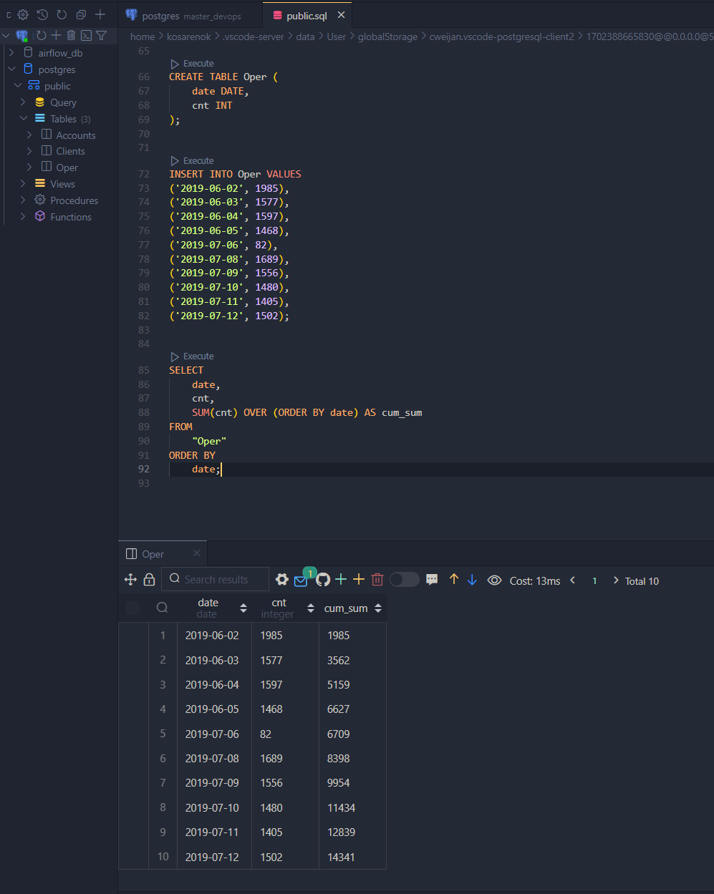
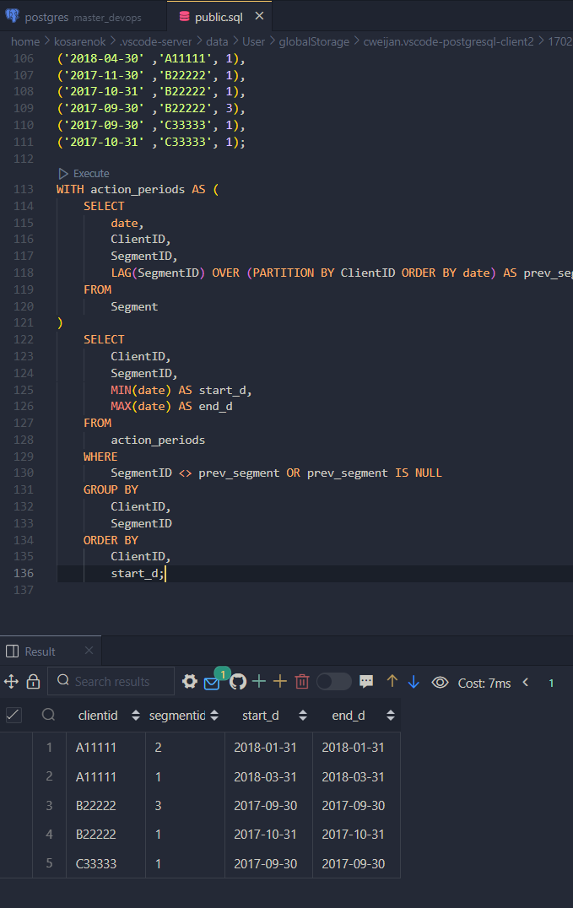

# Тестовое

## Задание 1

Создание таблиц:

```sql
CREATE TABLE "Clients" (
    client_id VARCHAR(1),
    FIO VARCHAR(255),
    Region VARCHAR(50),
    account_num INT
);


INSERT INTO "Clients" VALUES  
('A', 'Иванов', 'Москва', 111), 
('A', 'Иванов', 'Москва', 222), 
('B', 'Петров', 'Иваново', 333), 
('C', 'Сидоров', 'Москва', 444);


CREATE TABLE "Accounts" (
    "Date" DATE,
    Summa_USD INT,
    Account_num INT
);


INSERT INTO "Accounts" VALUES 
('2012-01-01', 15000, 111), 
('2012-02-01', 10000, 111), 
('2012-02-01', 5000, 222), 
('2012-03-01', 30000, 333), 
('2012-04-01', 20000, 444);
```

Отобрать клиентов по г. Москва с суммарными остатками по клиенту от 20 000 на последнюю дату.

```sql
WITH client_sum AS (
    SELECT
        k.client_id,
        k.FIO,
        k.Region,
        k.account_num,
        MAX(c."Date") AS last_date,
        SUM(c.Summa_USD) AS res_sum
    FROM
        "Clients" k
    JOIN
        "Accounts" c ON k.account_num = c.Account_num
    GROUP BY
        k.client_id,
        k.FIO,
        k.Region,
        k.account_num
)
    SELECT
        client_id,
        FIO,
        Region,
        account_num
    FROM
        client_sum
    WHERE
        Region = 'Москва'
        AND res_sum >= 20000;
```

Результат выполнения запроса:


## Задание 2

Создание таблиц:

```sql
CREATE TABLE Oper (
    date DATE,
    cnt INT
);

INSERT INTO Oper VALUES 
('2019-06-02', 1985), 
('2019-06-03', 1577), 
('2019-06-04', 1597), 
('2019-06-05', 1468), 
('2019-07-06', 82), 
('2019-07-08', 1689), 
('2019-07-09', 1556), 
('2019-07-10', 1480), 
('2019-07-11', 1405), 
('2019-07-12', 1502);
```

Вывести на каждую дату количества операций, совершенное с начала месяца по указанную дату включительно накопительным итогом.

```sql
SELECT
    date,
    cnt,
    SUM(cnt) OVER (ORDER BY date) AS cum_sum
FROM
    "Oper"
ORDER BY
    date;
```

Результат выполнения запроса:


## Задание 3

Создание таблиц:

```sql
CREATE TABLE Segment (
    date DATE,
    ClientID VARCHAR(6),
    SegmentID INT
);

INSERT INTO Segment VALUES  
('2018-01-31' ,'A11111', 2), 
('2018-02-28' ,'A11111', 2), 
('2018-03-31' ,'A11111', 1), 
('2018-04-30' ,'A11111', 1), 
('2017-11-30' ,'B22222', 1), 
('2017-10-31' ,'B22222', 1), 
('2017-09-30' ,'B22222', 3), 
('2017-09-30' ,'C33333', 1), 
('2017-10-31' ,'C33333', 1);
```

Даны месячные срезы сегментов клиентов, нужно получить по каждому клиенту периоды действия каждого сегмента

```sql
WITH action_periods AS (
    SELECT
        date,
        ClientID,
        SegmentID,
        LAG(SegmentID) OVER (PARTITION BY ClientID ORDER BY date) AS prev_segment
    FROM
        Segment
)
    SELECT
        ClientID,
        SegmentID,
        MIN(date) AS start_d,
        MAX(date) AS end_d
    FROM
        action_periods
    WHERE
        SegmentID <> prev_segment OR prev_segment IS NULL
    GROUP BY
        ClientID,
        SegmentID
    ORDER BY
        ClientID,
        start_d;
```

Результат выполнения запроса:


